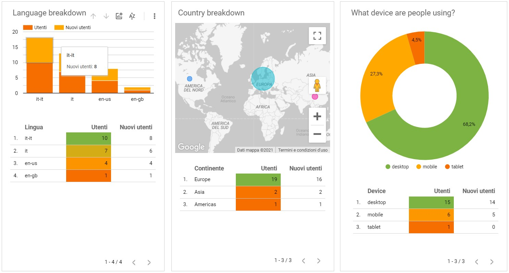

# Conclusions{#conclusions}

<!-- with UI build with free tool for front end design ion shiny [fomantic-ui](https://fomantic-ui.com/). prendi shiny app e rifai interface. in questo blog vedi Hacaton tirato e vincitori [blog](https://blog.rstudio.com/2020/11/10/the-appsilon-shiny-semantic-pocontest/).  -->

<!-- Senno app paula moraga che ha già simil modello dentro, -->

<!-- senno flexdashboard paula moraga. -->

<!-- [this inspiration](https://demo.appsilon.ai/apps/polluter/) -->

<!-- Reacttable blended in leaflet -->
<!-- https://glin.github.io/reactable/articles/examples.html -->

Ideally the entire work can be partitioned in two different pieces i.e. API and Spatial modeling communicating through a common language: data and  offering an end-to-end project. For what it concerns the API it consistently delivers data and avoids of all sorts of failures. From some of the statistics proposed throughout the analysis (\@ref(parallelscraping)), webscarping general performances are quite high in term of API response time, on which some further analysis are conducted. Results communicate that for 250 data points (6 columns per 10 web pages scrapped) the time taken for the first endpoint i.e. _scrapefast_ is 5 seconds in the very first interrogation (compatible with the background sessions openings \@ref(parallelscraping)). For all the following queries it requires a mean time of approximately 1.2 sec. The behavior is not well understood since the delay happens also for all the new queries even though sessions are already running in background (i.e. close on exit from application). The time spent might be attributed to a bottleneck caused in some helpers function, but the traceback has not been pursued yet. For larger amount of data (i.e. 2500 observation) the running time behaves linearly and the resulting response mean time is approximately 15 secs. Note that when arguments are the same the cache is able to return back data requested in no time.
Indeed for what concerns the second endpoint i.e. _completescrape_ for 250 data points (40 covariates including the spatials one) the time spent is 15 secs, and for bigger datasets it will occupy a couple of minutes. Results are summarized in table below.
Under the security umbrella no malicious attacks have been registered since the is its is being OPA (Open Public API), this was also due to the sought-after anonymity of the project. API Logs have registered in 4 months span time a timid usage from open source contributors and curious people which based on th query received tested the service. NGINX did its job with credentials even though it has never been required to load balance the api traffic since there were not traffic at all. Anyway the worst case scenario is accounted thanks to loadtest that has clearly shown which is the maximum treshold that the api handles previous crashing. In the end legal profiles have not been raised, thankfully. However given the progressive importance of web scraping and its market capitalization it is expected that major players will take precautions and manage their servers with stricter rules. The market orientation according to the author seems to subdivide players into two categories, the bigger ones ([Idealista.com](https://www.idealista.com/), [trovit](https://www.trovit.it/)) operating on more than one country i.e. Italy, Spain for which barriers have already been raised. And the smaller ones i.e. [casa.it](https://www.casa.it/) [soloaffitti.it](https://www.soloaffitti.it/) whose domain is ending with .it and whose barriers are not existing yet. Though jurisprudential guidelines lately have judged in favor of scrapers preventing the contestor from disallowing the access to their platform. As a matter of fact both of the parts need to meet halfway since there are a palette of greys between who is sneaking sensible data and who is benefiting from open data and be to the advantage of others through its externalities. Aside from this fact a major effort was put into making the disseration documents portable (\@ref(Infrastructure)) and available into a [website](https://niccolosalvini.github.io/thesis/), strechting to the maximun the concept of collaborative environment and open source. As a curiosity the author has also monitored through time the website audience embedding Google Analytics. What it has been observed in 5 months (Sep to Jan) is a modest international crowd coming from three continents (central panel fig. \@ref(fig:gaanalytics)) the most operating on desktop devices, even though a substantial slice browsed the thesis from their smartphone. The top location was Florence (hometown) with 19 access, immediately followed by Rome, Milan and Quincy (Massachusetts, USA). 

INLA unveals incredible results in terms of fitting time and capacity to make the most of its flexibility. Moreover open source projects that are integrating INLA are closing the gap in the learning curve since many tutorials and software can assist the researcher. What it might be for sure welcomed is a more `{tidyverse}` orientation and integration of new spatial data packages such as `sf` instead of the superseded `sp`. The model fitted wan not deeply nested since it includes only the random spatial effects, limiting the number of hyper parameters to 4. With that said INLA was able to fit the spatial model astonishingly quick, the cross validated model selection, which evaluates 31 different models has been fitted in $\approx 5$ minutes. However it is presumed that as soon as the dimensions of data increases then performances are going to be deteriorated. Triangulation has reached a sufficient amount of sophistication even though for unexplained reasons for certain values mesh computing does not converge. The model selection has clearly pointed out that many of the covariates are negligible to the price.
For what concerns the results of the spatial model it is ascertained that prices deeply depends on the location, moreover besides where prices are higher, it would be better concentrating on where are cheaper. As a matter of fact it seems that prices in posterior prediction are aligned on top of a longitudinal straight line traversing the map from south east through the north west. That suggests that cheaper rents are located throughout the orthogonal directrix.

