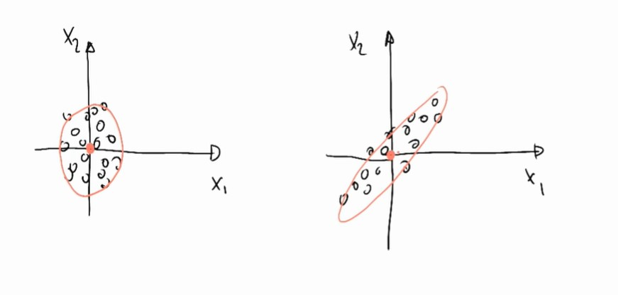

# Appendix {-}

## GP basics
[Nando de Freitas](https://www.youtube.com/watch?v=4vGiHC35j9s&t=164s)

lets say there are a cloiud of points represented by two variables x1 and x2. the cloud of points describesa  realization of theis two varibale i.e. hight and weight and then you just plot it , you might get mesaurament like that , 

or: each circle is a mesuduraments. now when we use multivariate gaussian we fit gaussian to data, the process of learning is to fit a gaussian to data, the ultimate goal is to describe the data, the smartest gaussian in the first image is to center the mean in the 0 and the draw a cricle containin all the other observation. Instaed for the second image it is still centering the mean in 0 but now it is an ellipse describing the variability, the size of the elipse descrube the variability of the data.
the center is a vector $\mu_{i}$ that it is beacuse we have two components $x_1$ and $x_2$ whhose mean is 0 for each of the other. This is true for all the observation which have two coordinates too $x_1$ and $x_2$. in vector notations we have for the mean:

$$
\boldsymbol{\mu}=\left[\begin{array}{l}
\mu_{x_1} \\
\mu_{x_2}
\end{array}\right]
$$

for each of the points, e.g. for point 1:

$$
\mathbf{x_1}=\left[\begin{array}{l}
x_1 \\
x_2
\end{array}\right]
$$

the can be neagtive positive, the Real numbers, usually we have $\mathbb{R}^{2}$ extending from - infinity to + infinity, to the power of two because we have 2 dimensions, a Real plane.

any point is gaussian distributed when with mean .. an variance. 
how we explain covariance, thorugh _correlation._
we do it by correlation with its noraml forms. the covariance is the term that goes insisde the matrices in the upper right of the matrxi we have the expectation of $x_1$ times $x_2$, like $\mathbb{E}(x_1 \cdot x_2)$, where the extactation in the gaussian case is the mean which is 0, so the corresponding values is 0.
the covariance essentially is the dot product of $x_1$ and $x_2$ what happens when you take the dot product of vectors, if for example you take a vector tgat looks like 1 and 0 ... dot product measure similarity. if rwo poiints are closed in two dimension then the dot will be height.

whene you plot in three D you can plot the joint distribiution which is bell shaped as gaussians are. 

sigma 1 and signa 2 if you have 1 d varibale the widjth has to be postive, for mulitvariate gaussian equl so here positive definitness: covariance mateix symetric.  
